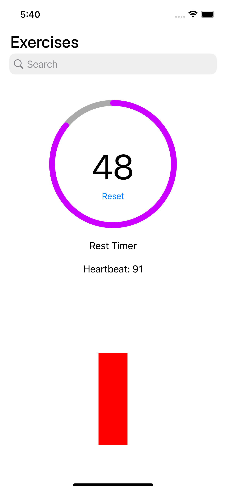

# GymRest: Optimize Your Workout Rest Periods

## Overview
GymRest is an innovative mobile application developed in Swift, aimed at enhancing your workout experience. By integrating with Apple's Health API, it utilizes data from your Apple Watch to monitor heart rate and determine the ideal rest time between workout sets. This balance ensures you recover adequately while maintaining a heart rate conducive to high-intensity training.

## Key Features
- **Heart Rate Monitoring**: Uses Terra's Health API to access real-time heart rate data from an Apple Watch.
- **Optimal Rest Time Calculation**: Analyzes heart rate and workout parameters to determine the best rest periods.
- **Workout API Integration**: Incorporates a variety of workouts and customizes rest times based on the exercise.
- **Dynamic Visual Feedback**: Features a heartbeat-like visual bar that mimics your heart rate, alongside a prominent rest timer.

## Running the Program
To run GymRest:
1. Clone the repository to your local machine.
2. Open the project in Xcode.
3. Run the `GymRest.xcodeproj` file.

## License
This project is licensed under the [MIT License](LICENSE.md) - see the LICENSE file for details.

---

© 2024 GymRest. All Rights Reserved.
